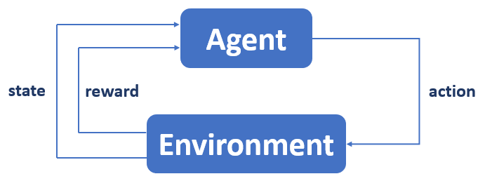

# DQN Snake Game

This project integrates the creation of the Snake game and the implementation of reinforcement learning to teach the snake to how play independently.

This project mainly uses the following Python libraries:
* **Gym**, to structure the Snake game to the standard of reinforcement learning;
* **Pygame**, to have a visual rendering of the game;
* **Tensorflow 2**, for the implementation of the neural network;

## What is a DQN?

The Deep Q Network (DQN) is the combination of two concepts: Q-learning, a subfield of reinforcement learning, and neural networks.

### Reinforcement learning

Reinforcement learning is a Machine Learning method that aims to create an agent and make it evolve in an environment in which it will be likely to take actions.
The actions chosen by the agent will aim to maximize its rewards.
The agent's objective is to determine a game strategy in order to maximize the sum of its rewards during a game.



### Q-Learning

Q-learning is a reinforcement learning method. The Q of Q-learning symbolizes the notion of quality.
This quality represents the usefulness of a given action to obtain a future reward.
This method can be used for solving simple problems. Q-learning is based on the following variables:
* **s**: system status;
* **a**: an action;
* **Q(s,a)**: a matrix of state-action values;

The objective is to make the agent interact with its environment by taking action.
The goal is to update state-action pairs of the matrix **Q(s,a)** by a value obtained from a function.
The function used to update the state-action matrix is Bellman's equation: &space;=&space;r&space;&plus;&space;ymax_{a'}Q(s',a'))

When learning how to solve a problem, two possible behaviors must be taken into account: **Exploration** (take an action randomly) or **Exploitation** (use of knowledge to choose an action).

### DQN : Neural network + Q-learning

The Deep Q Network is based on the principle of Q-Learning. The choice of an action will no longer be made according to a state-action table but by the use of a neural network.
The goal is to make a neural network learn the data retrieved during the exploration or exploitation phases.

Loss function : 

To improve the convergence of the model during learning phase, we use predictions made from a copy of the neural network (part in red) of the one used during learning.
This copy is updated after some time with the same weights as the neural network used during training.

This optimization method using a second target neural network comes from the following article: [Human-level control through deep reinforcement learning](https://storage.googleapis.com/deepmind-media/dqn/DQNNaturePaper.pdf)

## Tree of project

```
DQN_SnakeGame
├───dqn_snake_game.py
├───README.md
├───requirements.txt
│
├───dqn
│   ├───__init__.py
│   ├───agent.py
│   ├───dqnrun.py
│   ├───dqntrain.py
│   ├───experience.py
│   └───model.py
│
├───dqn_model
│
├───resources
│   └───reinfocement_learning_working.PNG
│
├───snake_game
│   ├───__init__.py
│   └───snake_game.py
│
├───snake_game_controller
│   ├───debug_snake_game.py
│   └───run_snake_game.py
│
├───utils
│   └───utils.py
└───video
    └───output.mp4
```

## Install

You need to use python 3.9.

If you need to create a virtual environment to clone the project:

`python3 -m venv DQN_SnakeGame_environment `

`source DQN_SnakeGame_environment/bin/activate `

Clone the repository:

`git clone https://github.com/TimLC/DQN_SnakeGame.git`

Install package requirements:

`pip install -r requirements.txt `

## How to run

To manually play a game of Snake, run the following command:

`python3 dqn_snake_game.py --action play`

| args         | type  | mandatory | default value |
|--------------|-------|-----------|---------------|
| --size_field | int   | no        | 18            |
| --time_speed | float | no        | 0.1           |

To train a DQN model on the Snake game, run the following command:

`python3 dqn_snake_game.py --action train_dqn`

| args                     | type  | mandatory | default value |
|--------------------------|-------|-----------|---------------|
| --steps                  | int   | no        | 100           |
| --save_rate              | int   | no        | 25            |
| --number_hide_layers     | int   | no        | 2             |
| --number_neural_by_layer | int   | no        | 64            |
| --buffer_size            | int   | no        | 100000        |
| --batch_size             | int   | no        | 1024          |
| --epsilon_decay          | float | no        | 3*1e-4        |
| --gamma                  | float | no        | 0.9           |
| --replace                | int   | no        | 100           |

To play part of the Snake game with a trained model, run the following command:

`python3 dqn_snake_game.py --action run_dqn`

| args                  | type | mandatory | default value |
|-----------------------|------|-----------|---------------|
| --model_name          | str  | yes       |               |
| --save                | bool | no        | False         |
| --file_name           | str  | no        | output        |

## Results

The following command lets you run a game of Snake with a trained model up to step 100, then save it.

`python3 dqn_snake_game.py --action run_dqn --model_name model_100 --save True`

Here is the result obtained:

<video src="video/output.mp4" controls="controls" style="max-width: 730px;">
</video>


## Author

Created by **Timothé Le Chatelier** in **2022**

